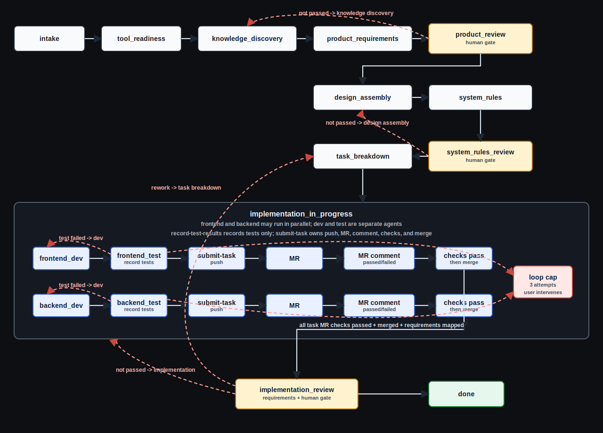

# Agent Spec Ops

Compact delivery harness for agent-led product work.

The harness keeps one source of truth in `runs/<DELIVERY_ID>/workflow-state.json`.
Agents should follow the state machine, not jump from a human prompt straight
into code.

Evaluation requests are evaluate-and-fix by default. When a run/session review
finds a confirmed harness or project-instruction root cause, apply the safe fix
before reporting. Stop at analysis only when the user says "evaluate only" or a
fix needs approval or unclear product-scope changes.

Linear status checks use the harness audit, not ad hoc agent queries:

```bash
node scripts/sync-linear-task.js runs/<DELIVERY_ID>/workflow-state.json --audit
```

The audit queries each recorded Linear issue id directly and reports non-terminal
tasks, stale links, missing ids, and status mismatches.

Codex session reviews use the local session audit:

```bash
node scripts/audit-codex-sessions.js --match FQ-BACKEND-001 --state runs/FQ-BACKEND-001/workflow-state.json
```

The audit scans matching Codex JSONL sessions and flags harness-relevant
patterns such as superseded workers, STOP-after-write ordering, branch
protection blockers, raw merge attempts, duplicate completion events, and
recorded leases without a scanned session.

Do not mark the whole Linear project Completed just because task issues are
done. `implementation_review` approves a delivery slice only. Closing a run
requires explicit human completion approval recorded with
`record-completion-approval.js`; otherwise, remaining scope goes back to
`task_breakdown`.

## Run Secrets

Run-scoped credentials belong in
`runs/<DELIVERY_ID>/.agent-spec-ops.secrets.env`, never in workflow state or
logs. Use the helper so values are written to an untracked mode-0600 file and
not echoed back:

```bash
node scripts/record-run-secrets.js runs/FTR-123/workflow-state.json --set LINEAR_API_KEY=<value>
node scripts/record-run-secrets.js runs/FTR-123/workflow-state.json --set GITHUB_TOKEN=<value>
node scripts/record-run-secrets.js runs/FTR-123/workflow-state.json --set LINEAR_TEAM_ID=<value> --set LINEAR_PROJECT_ID=<value>
node scripts/record-run-secrets.js runs/FTR-123/workflow-state.json --list
```

Harness scripts automatically load the run secret env file before checking
Linear/GitHub readiness, syncing Linear, reviewing PRs, or submitting tasks.

## Flow

```text
intake
-> tool_readiness
-> knowledge_discovery
-> product_requirements
-> product_review
-> design_assembly
-> system_rules
-> system_rules_review
-> task_breakdown
-> implementation_in_progress
-> implementation_review
-> done
```



## Human Gates

- `product_review`: if not passed, go back to `knowledge_discovery`.
- `system_rules_review`: if not passed, go back to `design_assembly`.
- `implementation_review`: if not passed, go back to `implementation_in_progress`.
- If the user requests rework, go back to `task_breakdown`.

## Task Breakdown

`task_breakdown` creates Linear tasks. Each task must include:

- title
- description
- lane: `frontend` or `backend`
- role: dev or test
- scope
- dependencies
- definition of done
- verification/test plan
- expected MR description

No Linear task, no implementation.

Record task entries through the harness, then sync Linear:

```bash
node scripts/record-task-breakdown.js runs/<DELIVERY_ID>/workflow-state.json --file runs/<DELIVERY_ID>/task-breakdown.json --dependencies-checked
node scripts/sync-linear-task.js runs/<DELIVERY_ID>/workflow-state.json --create
```

Do not create temporary scripts or edit `workflow-state.json` directly to
mutate `task_graph.tasks`.

## Implementation

Delivery WIP is exactly one task. Dev and test are separate agents handing off
the same task until its PR is merged, verified, and synchronized to Linear.
Same-account/admin merge and protected checks are controlled by
`implementation.git_policy`:

```text
frontend_dev -> frontend_test(record-test-results) -> submit-task(push/PR/admin-merge if allowed)
backend_dev  -> backend_test(record-test-results)  -> submit-task(push/PR/admin-merge if allowed)
```

If test fails, return to dev. If a dev/test loop reaches 3 attempts, stop and
ask the user to intervene.

Default build/general sessions and orchestrator must not start dev servers,
background daemons, Cypress, Playwright, or full test suites. Test agents must
use bounded task-scoped commands; on timeout, hang, or first failing run, record
failed evidence and return to dev instead of rerunning full suites.
Use `run-task-command.js` for task build/test commands; it caps execution at
120 seconds and records pass/fail/timeout evidence in workflow state.
Local browser E2E must be visible/headed by default so the user can watch. Use
headless only in CI, when the user explicitly asks, or for a final artifact-only
check; if visible mode is unavailable, stop and report it.

Hard gates are enforced by scripts:

- `read-context.js`, `read-instructions.js`, and `validate-state.js` fail if the run state was edited outside trusted harness writers.
- Orchestrator cannot write project files or run dev/test directly.
- Project writes require `check-write-scope.js` with the matching active role.
- Worker sessions should pass `--agent-id` or set `AGENT_SPEC_OPS_AGENT_ID`
  when running `check-write-scope.js`; a superseded worker is denied even if its
  old role and task scope still match.
- Task transitions require a recorded spawn lease from `record-agent-spawn.js` with the exact `agent-spec-*` OpenCode agent name.
- `implemented` requires scoped changed files and implementation evidence.
- Test results require the task to be `testing` and a matching test-agent lease.
- `verified` requires changed files, test evidence, branch, push, MR URL, passed MR status comment URL, and merged MR evidence. MR check evidence is required only when `auto_merge_requires_checks=true`.
- `submit-task.js` follows `implementation.git_policy`: same-account/admin merge is allowed when `allow_same_github_account_review=true` and `allow_admin_merge=true`; code-host checks are required only when `auto_merge_requires_checks=true`.
- `record-test-results.js` records tests and MR status comments only; dev-task MR check/merge evidence must come from `submit-task.js`.
- `record-pr-review.js` records the matching test agent's independent PR verdict against the exact submitted HEAD only when `review_required_before_merge=true`.
- Task transitions synchronize Linear synchronously. Sync failure or timeout is visible, non-zero, and blocks the next task.
- `submit-task.js` refuses unrelated dirty files instead of staging the whole worktree.
- `seal-state.js` is trusted manual repair only. It refuses to seal if `validate-state.js` still reports workflow errors.

## Commands

```bash
node scripts/new-delivery.js FTR-123 "Delivery title"
node scripts/read-context.js runs/FTR-123/workflow-state.json --role orchestrator
node scripts/read-instructions.js runs/FTR-123/workflow-state.json --role orchestrator
node scripts/plan-agent-dispatch.js runs/FTR-123/workflow-state.json --enable-auto
node scripts/record-agent-spawn.js runs/FTR-123/workflow-state.json <SPAWN_ID> <REAL_OPENCODE_SESSION_ID> --agent <AGENT_NAME>
node scripts/record-run-secrets.js runs/FTR-123/workflow-state.json --set LINEAR_API_KEY=<value> --set GITHUB_TOKEN=<value>
node scripts/check-write-scope.js runs/FTR-123/workflow-state.json <TARGET_PATH> frontend_dev
node scripts/transition.js runs/FTR-123/workflow-state.json product_review "Requirements ready"
node scripts/record-task-breakdown.js runs/FTR-123/workflow-state.json --file runs/FTR-123/task-breakdown.json --dependencies-checked
node scripts/transition-task.js runs/FTR-123/workflow-state.json FE-001 active "Starting"
node scripts/record-test-results.js runs/FTR-123/workflow-state.json --task FE-001 --status passed --role frontend_test --command "npm test" --output "..." --mr-comment-url "<URL>"
node scripts/record-pr-review.js runs/FTR-123/workflow-state.json FE-001 --status passed --role frontend_test --summary "review summary" --evidence "review evidence"
node scripts/run-task-command.js runs/FTR-123/workflow-state.json FE-001 --role frontend_test --label "unit tests" --timeout-ms 120000 -- npm test
node scripts/submit-task.js runs/FTR-123/workflow-state.json FE-001 --commit-msg "feat: FE-001: summary" --test-command "npm test"
node scripts/reopen-delivery.js runs/FTR-123/workflow-state.json "Human requested rework"
node scripts/validate-harness.js
```

Trusted manual repair only:

```bash
node scripts/seal-state.js runs/FTR-123/workflow-state.json "manual repair reason"
```

Generate project instructions and OpenCode agents:

```bash
node scripts/generate-project-agents.js runs/FTR-123/workflow-state.json --project-repo ../my-project --role orchestrator
```

This updates the project `AGENTS.md` and writes `.opencode/agents/agent-spec-orchestrator.md`,
frontend/backend dev/test agents, `agent-spec-pr-reviewer.md`, and
`.opencode/commands/agent-spec-spawn.md`.

Run monitor:

```bash
npm run monitor
```

Open `http://127.0.0.1:8787`.
