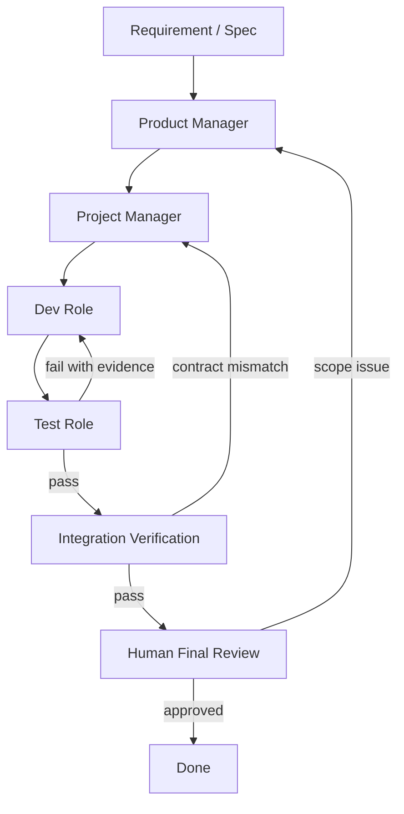

# Bounded Loops

The harness is designed around controlled feedback loops. A loop is valid only
when it has inputs, outputs, exit conditions, and a maximum attempt count.

## Core Loop



## Loop Types

| Loop | Trigger | Exit |
| --- | --- | --- |
| Product loop | Requirements unclear or UX/system rules rejected | Product gate approved |
| Planning loop | Task graph too vague, untestable, or incomplete | Delivery plan gate approved |
| Frontend dev/test loop | Frontend test failure | Frontend tasks verified |
| Backend dev/test loop | Backend unit/integration failure | Backend tasks verified |
| Integration loop | Frontend/backend contract mismatch | Integration verification passed |
| Knowledge improvement loop | Run completed | Handoff and reusable findings recorded |

Each loop should end with a memory pass:

```text
role output -> eval/remark -> event ledger -> candidate knowledge -> next packet
```

Use `scripts/record-eval.js` for scored loop outcomes and
`scripts/record-remark.js` for qualitative observations. If a loop reveals a
repeated pattern, create a candidate knowledge card and promote it only after
approval or enough evidence.

## Loop Control

Each loop has:

- `status`
- `attempt`
- `max_attempts`
- `last_failure`
- `history[]`

Default `max_attempts` is `3`.

Escalate when:

- The same failure repeats.
- A task requires scope change.
- A test conflicts with acceptance criteria.
- A needed source cannot be verified.
- The loop reaches `max_attempts`.

## Failure Reports

A failure report should include:

- Failing task ID
- Expected behavior
- Actual behavior
- Reproduction steps or command
- Evidence link/path
- Suspected cause
- Whether the issue is implementation, test expectation, product ambiguity, or planning gap

Use `templates/failure-report.md`.
