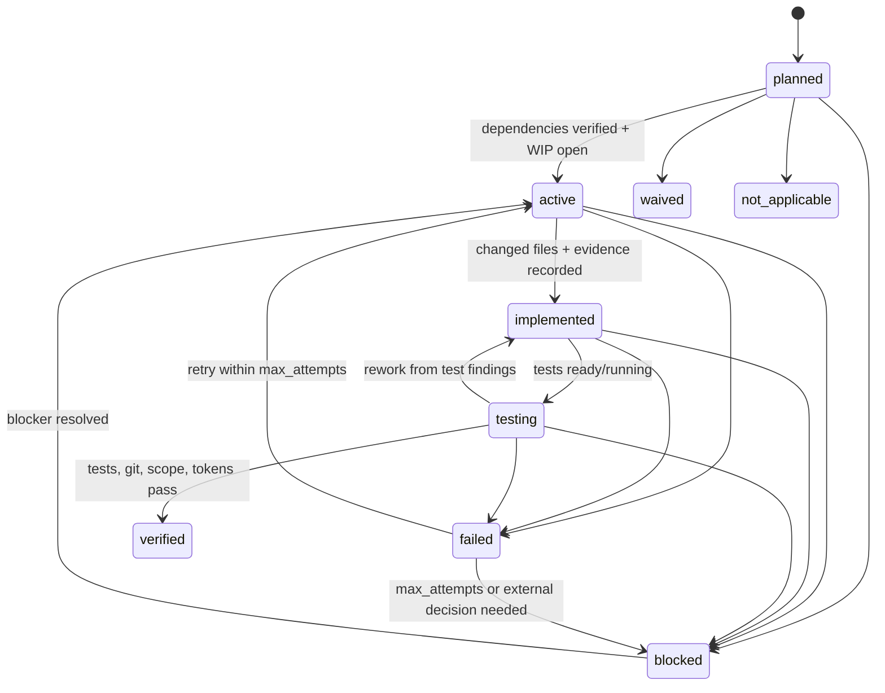

## Per-Task State Transitions

Every task must move through its lane state machine using
`scripts/transition-task.js`. Do **not** edit `task.status` directly in the
state file.

## State Machine Weaknesses To Guard Against

The harness is intentionally redundant: scripts enforce the machine, docs teach
the agent, and `workflow-state.json` survives compaction. Failures usually come
from drift between those layers. Treat these as active risks:

- **Contract drift**: `scripts/lib/state-machine.js`, `schemas/workflow-state.schema.json`, `harness.yaml`, examples, and docs must name the same states.
- **Conversation memory drift**: any instruction, API configuration, gate decision, blocker, or task status that only exists in chat is considered lost.
- **Implicit transition criteria**: if a state exit requires evidence, the evidence must be in state or a run artifact before the transition command runs.
- **Direct state edits**: hand-editing `workflow-state.json` can bypass script checks and create invalid top-level/task correlations.
- **Stale recovery context**: after compaction, interruption, or visible state changes, run `read-context.js` again before acting.

`scripts/validate-harness.js` must fail if the machine-readable state lists drift.

## Policy, State Size, And Instruction Size

Policy is enforced by `harness-policy.json` plus `scripts/lib/policy.js`.
Agents should not treat policy rules as prose preferences. If Linear, secret
storage, task IDs, or knowledge sync violate policy, mutating scripts must fail.

Keep `workflow-state.json` operational, not archival. When logs or loop history
grow large, run:

```bash
node scripts/compact-state.js runs/<DELIVERY_ID>/workflow-state.json
```

This moves older history to `runs/<DELIVERY_ID>/archives/` and writes
`workflow-summary.json` for quick recovery.

Keep instruction loading just-in-time. After `read-context.js`, run:

```bash
node scripts/read-instructions.js runs/<DELIVERY_ID>/workflow-state.json --role <ROLE>
```

Read full docs only when the compact packet points to a specific need.

```bash
node scripts/transition-task.js runs/<DELIVERY_ID>/workflow-state.json <TASK_ID> <STATUS> "[NOTE]"
```

### Task Lane Transitions



### Top-Level Transition Checklist

Use this checklist before every `scripts/transition.js` call. If any required
item is missing, update state/artifacts first or stop at the correct blocker.

| Transition | Required checklist |
| --- | --- |
| `intake → tool_readiness` | `delivery.id`, `delivery.title`, `delivery.request_summary`, source links/target users when known |
| `tool_readiness → waiting_for_tool_readiness_review` | `tool_readiness.status` is `ready` or `partial`; tracker and code host choices recorded; human instructions prepared and sent |
| `waiting_for_tool_readiness_review → knowledge_discovery` | `gates.tool_readiness_review.status=approved`; approver, note, timestamp, and evidence recorded |
| `waiting_for_tool_readiness_review → tool_readiness_revision` | Requested changes recorded in gate evidence/blocker; readiness issue owner clear |
| `knowledge_discovery → product_requirements` | Sources/findings/gaps recorded; open gaps are accepted risk or under budget |
| `product_requirements → ui_design_prompt` | Product requirements artifact path/status/evidence recorded |
| `ui_design_prompt → waiting_for_design_stitch` | Stitch prompt artifact ready; human instructions sent with decision options/questions |
| `waiting_for_design_stitch → design_assembly` | `gates.design_stitch.status=approved`; Stitch project URL/ID or explicit fallback recorded |
| `design_assembly → system_rules` | Design assets saved under `runs/<DELIVERY_ID>/design-assets/`; fetch failures are not treated as evidence |
| `system_rules → waiting_for_product_review` | Requirements, Stitch prompt, design assets, and system rules are ready for review; human instructions sent |
| `waiting_for_product_review → product_approved` | Product gate approved with approver, note, timestamp, and artifact evidence |
| `waiting_for_product_review → product_revision` | Requested changes recorded; affected artifacts identified |
| `product_approved → task_breakdown` | Product baseline frozen; no unresolved product blockers |
| `task_breakdown → waiting_for_delivery_plan_review` | Every task has description, DoD, expected changes, verification, scope, dependencies checked, and Linear IDs when Linear is configured; human instructions sent |
| `waiting_for_delivery_plan_review → delivery_plan_approved` | Delivery plan gate approved with approver, note, timestamp, and evidence |
| `waiting_for_delivery_plan_review → task_revision` | Requested changes recorded; affected tasks identified |
| `delivery_plan_approved → implementation_in_progress` | Approved scope populated; task graph approved; dispatch mode decided |
| `implementation_in_progress → frontend_dev/backend_dev` | At least one dependency-ready task exists in that lane; WIP=1 not violated |
| `frontend_dev/backend_dev → frontend_test/backend_test` | Active task is `implemented`; changed files, deviations, and implementation evidence recorded |
| `frontend_test/backend_test → frontend_verified/backend_verified` | All tasks in that lane are `verified`, `waived`, or `not_applicable` |
| `frontend_verified/backend_verified → integration_verification` | All required frontend and backend tasks are `verified`, `waived`, or `not_applicable` |
| `integration_verification → knowledge_improvement` | Integration checks pass or are explicitly waived; contract/scope/acceptance evidence recorded |
| `knowledge_improvement → waiting_for_final_review` | Reusable knowledge promoted or waiver recorded; Linear knowledge sync attempted when configured; final review instructions sent |
| `waiting_for_final_review → done` | Final gate approved; handoff artifact ready; clean-state checks complete |
| `waiting_for_final_review → task_breakdown` | Use `scripts/reopen-delivery.js`; rework reason recorded; final review gate reset |
| `any → blocked` | Blocker has owner, evidence, and next required external action |

### Rules Per Transition

- **planned → active**: All dependencies (`depends_on`) must be `verified`,
  `not_applicable`, or `waived`. WIP=1 enforced per role lane — only one
  `active` task per lane at a time.

- **active → implemented**: Code is written. Changed files and implementation
  evidence must be recorded in `task.implementation`.

- **implemented → testing**: Tests are running or ready to run.

- **testing → verified**: Test execution evidence AND Git lifecycle must be complete:
  - `task.test.status` must be `"passed"` (recorded via `scripts/record-test-results.js`)
  - `task.test.last_run_at` must be set (tests were actually executed, not just claimed)
  - `task.test.commands` must contain at least one command
  - `task.test.failures` must be empty
  - `git_flow.local_tests_passed = true` with `test_evidence`
  - `git_flow.pushed = true` with `push_evidence`
  - `git_flow.merge_request_status` is `created`, `open`, or `merged` with URL
  - If `auto_merge = true`: `merge_checks_passed` and `merged` must be true

  Agents cannot skip test execution by setting `git_flow.local_tests_passed = true`
  directly — the `transition-task.js` script now requires `task.test` to have been
  populated via `record-test-results.js`. Always use `record-test-results.js` to
  record test outcomes.

- **any → failed**: Records failure in `task.loop.last_failure` and increments
  attempt counter. After `max_attempts` retries, escalate via `blocked`.

- **any → blocked**: Stops work on this task. Requires a blocker description.

### Top-Level State Correlation

The top-level workflow state updates automatically when tasks transition:

| When all frontend tasks are... | Top-level state advances to |
|--------------------------------|---------------------------|
| `active` or `implemented` | `frontend_dev` |
| `testing` | `frontend_test` |
| `verified` | `frontend_verified` |
| `verified` (and backend done) | `integration_verification` |

| When all backend tasks are... | Top-level state advances to |
|------------------------------|---------------------------|
| `active` or `implemented` | `backend_dev` |
| `testing` | `backend_test` |
| `verified` | `backend_verified` |
| `verified` (and frontend done) | `integration_verification` |

Use `scripts/transition.js` only for non-implementation transitions
(intake through delivery plan approval, integration_verification through done).
For implementation lane work, always use `scripts/transition-task.js`.

Do **not** use `scripts/transition.js` to jump from `implementation_in_progress`
straight to `integration_verification` — this bypasses lane sub-states and will
be rejected if dev tasks are unverified.

### Knowledge Improvement Gate

Starting from `integration_verification`, the state machine now requires a
`knowledge_improvement` step before `waiting_for_final_review`:

```
integration_verification → knowledge_improvement → waiting_for_final_review
```

Transition to `knowledge_improvement` after integration checks pass. This state
is the signal to promote reusable knowledge cards and sync knowledge to Linear.
The `transition.js` script automatically syncs knowledge to Linear when entering
`knowledge_improvement` or `waiting_for_final_review` (if `LINEAR_API_KEY` is set).

After promoting knowledge and syncing to Linear, transition to
`waiting_for_final_review`:

## State Field Maintenance

> [!WARNING]
> **Session Compaction Warning**
> DO NOT rely on conversational memory for API keys, user instructions, or state flags. The chat history will inevitably be truncated to save tokens, erasing anything not permanently saved.
> You MUST persist all data to `workflow-state.json`.
>
> [!CAUTION]
> **STRICT COMPLIANCE REQUIRED**
> You are strictly forbidden from editing `workflow-state.json` via text manipulation, `sed`, or text editors. You MUST use the automated script below. If the script throws a `FATAL` error (e.g. invalid JSON syntax), you must fix your syntax instead of bypassing the script. Bypassing the script is considered CHEATING and will result in run termination.

```bash
node scripts/record-event.js runs/<DELIVERY_ID>/workflow-state.json --type config_update --summary "Update state" --set "path.to.field=value"
```

You MUST keep `workflow-state.json` fields current after every meaningful
action. The monitor UI reads these fields — stale state misleads both human
reviewers and future agent sessions.

### Checklist: fields to update and when

| Field | When to update | How |
|-------|---------------|-----|
| `tool_readiness.choices.product_tracker` | After tool readiness check | Via `check-tool-readiness.js` or `record-event.js --set` |
| `tool_readiness.choices.code_host` | After tool readiness check | Via `check-tool-readiness.js` or `record-event.js --set` |
| `tool_readiness.status` | After tool readiness check + human approval | Via `transition.js` |
| `token-usage.csv` (via `record-token-usage.js`) | After each agent run, task, eval, or tool-heavy segment | `node scripts/record-token-usage.js ...` |
| `task.git_flow.*` | After each git step (branch, test, push, MR, merge) | Via `record-event.js --set` — see Dev Git Lifecycle table |
| `task.implementation.changed_files` | After implementation | Via `record-event.js --set` |
| `task.implementation.evidence` | After implementation | Via `record-event.js --set` |
| `task.test.*` | After running tests | Via `record-test-results.js` |
| `task.status` | On each lane transition | **Always** via `transition-task.js` (never edit directly) |
| `state.current_state` | Auto-updated by `transition-task.js` | Check it after transitions |
| `memory.*` | After events, evals, remarks | Via respective record scripts |
| `delivery.updated_at` | On any change | Auto-set by scripts, or set manually |
| `artifacts.*` | After generating artifacts | Via artifact scripts or `record-event.js --set` |
| `human_instructions.*` | When sending/finalizing review instructions | Via `record-event.js --set` |
| `gates.*` | When human approves/denies a gate | Via `record-event.js --set` |

(Use `scripts/transition-task.js` for task status changes).

### Token usage must be recorded regularly — enforced at verified

**This is now enforced.** The `testing → verified` transition requires at
least one non-zero token usage row for the task. If you skip token recording,
the transition will be rejected.

After every task implementation, test run, eval, or tool-heavy segment, record
actual token counts:

```bash
node scripts/record-token-usage.js runs/<DELIVERY_ID>/workflow-state.json \
  --scope task --task <TASK_ID> \
  --input-tokens <N> --output-tokens <N> --total-cost-usd <N> --cost-basis actual
```

If the runtime exposes token counts per API call, record them immediately
after the call. If it only exposes per-session or per-run totals, record a
cumulative row at the end of the session.

If the runtime does not expose per-call token counts, record an estimated
row at task boundaries so the monitor shows non-zero usage:

```bash
node scripts/record-token-usage.js runs/<DELIVERY_ID>/workflow-state.json \
  --scope task --task <TASK_ID> \
  --total-tokens <N> --total-cost-usd <N> --cost-basis estimated \
  --notes "Estimated from session totals"
```

### Context recovery at session start

When resuming an existing delivery, always run context recovery first:

```bash
node scripts/read-context.js runs/<DELIVERY_ID>/workflow-state.json
```

This dumps current state, task summary, Linear mappings, token totals,
tool readiness, and gate status. If any fields appear stale (e.g., old
timestamps, zero token counts after known work), update them before
proceeding.

Context recovery is also required after compaction, interruption, role handoff,
or any time `workflow-state.json` changed outside the current script. Transition
scripts maintain a `.session.json` marker and reject stale context. If rejected,
run `read-context.js` again, re-read the role instructions in the output, then
retry the transition.
