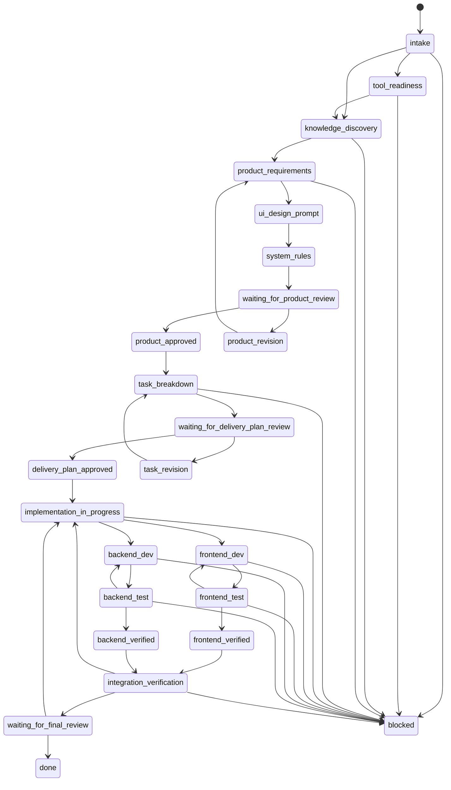

# Workflow

This harness is a state machine for turning a spec or delivery request into
implemented and verified frontend/backend delivery work.

## Transition Graph



## State Definitions

| State | Owner | Purpose | Exit Evidence |
| --- | --- | --- | --- |
| `intake` | Orchestrator | Normalize raw request, source links, target outcome | `delivery.id`, `delivery.title`, intake log |
| `tool_readiness` | Orchestrator | Choose and verify tracker, code host, frontend tooling, backend tooling | `tool_readiness` evidence |
| `knowledge_discovery` | Orchestrator | Find and verify relevant product, design, system, repo, and verification knowledge | `knowledge.findings[]` or `knowledge.gaps[]` |
| `product_requirements` | Product Manager | Write product requirements, acceptance criteria, open questions | Product artifact draft |
| `ui_design_prompt` | Product Manager | Write Google Stitch prompt grounded in requirements | Stitch prompt draft |
| `system_rules` | Product Manager | Derive UI behavior, business rules, API implications | System rules draft |
| `waiting_for_product_review` | Human | Approve or revise product artifacts | Product gate decision |
| `product_revision` | Product Manager | Revise requirements/rules after review | Updated artifact evidence |
| `product_approved` | Orchestrator | Freeze approved product baseline | Product gate approval |
| `task_breakdown` | Project Manager | Break approved product baseline into executable tasks | Task graph |
| `waiting_for_delivery_plan_review` | Human | Approve or revise task graph | Delivery gate decision |
| `task_revision` | Project Manager | Revise task graph after review | Updated task graph evidence |
| `delivery_plan_approved` | Orchestrator | Freeze approved task baseline | Delivery gate approval |
| `implementation_in_progress` | Orchestrator | Dispatch lane work, optionally plan agents, and monitor loops | Active lane/task state |
| `frontend_dev` | Frontend Dev | Implement approved frontend tasks | Changed files and build evidence |
| `frontend_test` | Frontend Test | Create/run frontend tests; pass or return failure | Test evidence or failure report |
| `frontend_verified` | Orchestrator | Mark frontend lane verified | All FE tasks verified |
| `backend_dev` | Backend Dev | Implement approved backend tasks | Changed files and build evidence |
| `backend_test` | Backend Test | Create/run unit/integration tests; pass or return failure | Test evidence or failure report |
| `backend_verified` | Orchestrator | Mark backend lane verified | All BE tasks verified |
| `integration_verification` | Orchestrator | Run contract checks, scope checks, acceptance checks, and full evidence review | Passing integration evidence |
| `waiting_for_final_review` | Human | Approve final result or request rework | Final gate decision |
| `done` | Orchestrator | Produce final handoff and close run | Handoff report |
| `blocked` | Any | Stop because progress requires external input/change | Blocker with owner |

## Implementation Lane Rules

Frontend and backend lanes can be interleaved, but each lane follows WIP=1.
The state file tracks exact task statuses. The top-level state tells the
orchestrator which lane is currently being worked or reviewed.

The harness may move to `integration_verification` only when every required
frontend and backend task is `verified`, `not_applicable`, or explicitly
`waived` with evidence.

Frontend/backend dev tasks may be `implemented` before they are pushed. They may
not be `verified` until:

- The task feature branch was created from `main`.
- Matching test evidence passed.
- The feature branch was pushed.
- A merge request/pull request targeting `main` exists.
- The merge request/pull request is merged by default after merge checks pass,
  unless auto-merge is explicitly disabled with a reason.

The harness may move to `waiting_for_final_review` only when:

- `scripts/check-contracts.js` has no failed or blocked checks.
- `scripts/check-scope.js` has no failed or blocked checks.
- Acceptance criteria are mapped to evidence.
- Integration status is `passed` or explicitly `waived`.

## Parallel Agent Dispatch

Use `scripts/plan-agent-dispatch.js` after delivery plan approval to create
spawn requests for dependency-ready tasks. The planner refuses automatic
parallelism when task write scopes are missing or overlap.

The orchestrator must execute planned spawn requests through the active agent
runtime and then record leases with `scripts/record-agent-spawn.js`.

## Legal Transition Checks

Use:

```bash
node scripts/transition.js runs/<DELIVERY_ID>/workflow-state.json <next_state> "Reason"
```

The transition script rejects illegal state moves and records successful moves
in `log[]`.
